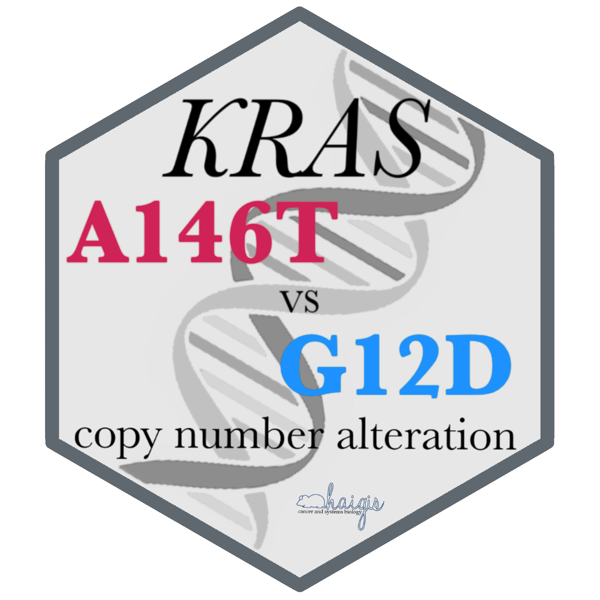

<!-- README.md is generated from README.Rmd. Please edit that file -->

```{r setup, include = FALSE}
knitr::opts_chunk$set(
  collapse = TRUE,
  comment = "#>",
  fig.path = "man/figures/README-",
  out.width = "100%"
)
library(KrasAlleleCna)
library(dplyr)
library(readr)
library(tibble)
library(stringr)
library(magrittr)
library(ggplot2)
```
# *KRAS* allele-specific CNA <a href="https://jhrcook.github.io/KrasAlleleCna/index.html">  </a> 

[](https://www.gnu.org/licenses/gpl-3.0)
[](https://travis-ci.org/jhrcook/KrasAlleleCna)
[](https://ci.appveyor.com/project/jhrcook/KrasAlleleCna)
[](https://codecov.io/github/jhrcook/KrasAlleleCna?branch=master)

You can install this R package from GitHub and run the analyses yourself (the raw data files are not included, though have been loaded into RData objects, already).

```{r installation, eval=FALSE}
devtools::install_github("jhrcook/KrasAlleleCna")
library(KrasAlleleCna)
```

A website to peruse this work is available [here](https://jhrcook.github.io/KrasAlleleCna/). The Vignettes contain the analyses.

## Purpose

In [Poulin *et al.* (2019)](http://cancerdiscovery.aacrjournals.org/content/early/2019/04/05/2159-8290.CD-18-1220), the authors studied the specific oncogenic properties of *KRAS* A146T mutations, a hotspot-mutation only found in colorectal adenocarcinoma (COAD). For this paper, I was asked to find out whether there was a difference in the copy number of the mutant allele between human COAD patients with G12D (the most common *KRAS* oncogenic mutation) and A146T mutations. Not only would a difference suggest that dosage is an important factor, but could also point to differences in interactions with the wild-type (WT) allele ([Zhou *et al.*, 2016](https://www.ncbi.nlm.nih.gov/pubmed/27422332), [Lin and Haigis, 2018](https://www.ncbi.nlm.nih.gov/pubmed/29425486)). 

This analysis was divided into 4 parts: A) downloading the data, B) processing the data, C) calculating the allele copy number, and D) analyzing the results.

## Conclusions

There was no detectable difference between the copy number of the G12D or A146T *KRAS* alleles.

The below plot showed the copy number of the mutant and WT allele in G12D and A146T samples.

```{r lateralplot, echo=FALSE, warning=FALSE, cache=TRUE}
cn_tib <- allele_data_filt %>%
    filter(project_id %in% c("TCGA-COAD", "TCGA-READ")) %>%
    group_by(aa_mod) %>%
    mutate(allele_count = n_distinct(common_id)) %>%
    ungroup() %>%
    mutate(cn_mut = ifelse(cn_mut < 0, 0, cn_mut),
           cn_wt = ifelse(cn_wt < 0, 0, cn_wt),
           codon = as.numeric(str_extract(aa_mod, "[:digit:]+")))
cn_tib %>%
    mutate(aa_mod = forcats::fct_reorder(aa_mod, codon)) %>%
    filter(aa_mod %in% c("A146T", "G12D")) %>%
    mutate(diff = cn_mut - cn_wt) %>%
    ggplot() +
    facet_grid(. ~ aa_mod) +
    geom_segment(aes(x = "mutant", xend = "wild type",
                     y = cn_mut, yend = cn_wt,
                     color = diff)) +
    geom_point(aes(x = "mutant", y = cn_mut, color = diff), size = 1) +
    geom_point(aes(x = "wild type", y = cn_wt, color = diff), size = 1) +
    scale_color_gradient(low = "blue", high = "red") +
    theme(panel.background = element_rect(fill = "white"),
          panel.grid.major = element_line(color = "grey85"),
          legend.key.height = unit(0.2, "in"),
          legend.key.width = unit(0.1, "in"),
          axis.ticks = element_line("grey85"),
          strip.background = element_blank()) +
    labs(x = "allele", y = "copy number",
         title = "Copy number of both alleles in KRAS mutants",
         color = "CN difference")

```

Though there seems to be increased amplification in human tumor samples, the number of available samples limited the power of the study.

Heatmaps of the genotypes of the samples highlighted that the most common genotype was 1 mutant : 1 WT allele.

```{r genotypeheatmap, echo=FALSE, warning=FALSE, out.width=c('50%', '50%'), fig.show='hold', cache=TRUE}
plot_genotype_heatmap(cn_tib, "A146T")
plot_genotype_heatmap(cn_tib, "G12D")
```

---

**Check out more work from the Haigis Lab at our [website](https://www.haigislab.org)!**

Any mistakes or questions? Open an [Issue](https://github.com/jhrcook/KrasAlleleCna/issues) on GitHub.

