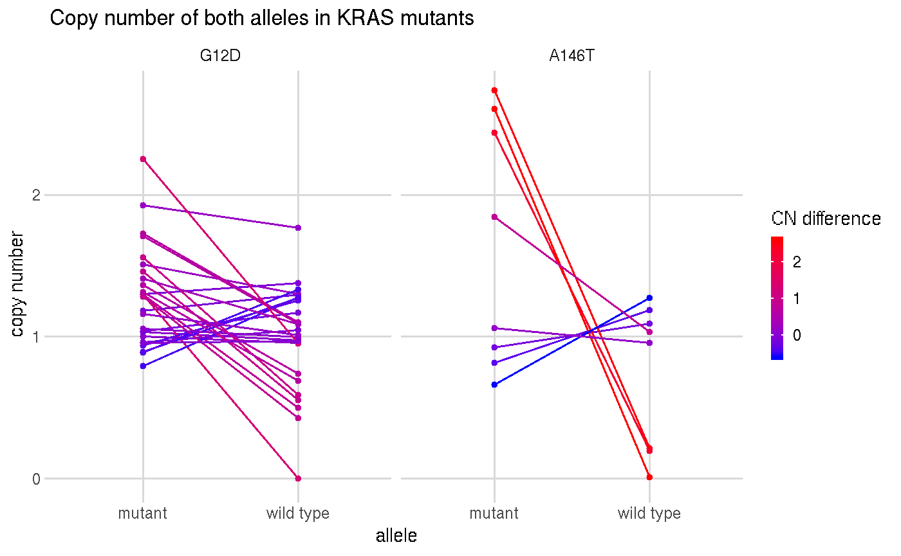
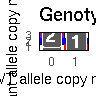
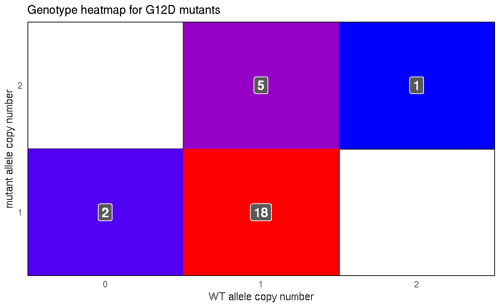

<!-- README.md is generated from README.Rmd. Please edit that file -->

# KrasAlleleCna

## Purpose

In [Poulin *et al.*
(2019)](http://cancerdiscovery.aacrjournals.org/content/early/2019/04/05/2159-8290.CD-18-1220),
the authors studied the specific oncogenic properties of *KRAS* A146T
mutations, a hotspot-mutation only found in colorectal adenocarcinoma
(CRC). For this paper, I was asked to find out whether there was a
difference in the copy number of the mutant allele between human CRC
patients with G12D (the most common *KRAS* oncogenic mutation) and A146T
mutations. Not only would a difference suggest that dosage is an
important factor, but could also point to differences in interactions
with the wild-type (WT) allele \[[Zhou *et al.*,
2016](https://www.ncbi.nlm.nih.gov/pubmed/27422332), [Lin and
Haigis, 2018](https://www.ncbi.nlm.nih.gov/pubmed/29425486)\].

This analysis was divided into 4 parts: A) downloading the data, B)
processing the data, C) calculating the allele copy number, and D)
analyzing the results.

## Conclusions

There was no detectable difference between the copy number of the G12D
or A146T *KRAS* alleles.

The below plot showed the copy number of the mutant and WT allele in
G12D and A146T
    samples.

    #> Warning: Removed 10 rows containing missing values (geom_segment).
    #> Warning: Removed 10 rows containing missing values (geom_point).
    
    #> Warning: Removed 10 rows containing missing values (geom_point).

Though there seems to be increased amplification in human tumor samples,
the number of available samples limited the power of the study.

Heatmaps of the genotypes of the samples highlighted that the most
common genotype was 1 mutant : 1 WT
allele.

